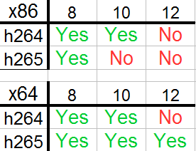

## vEncode

vEncode.bat is a Windows script that encodes video to h264/h265.

aEncode.bat, a companion script, supports audio-only encoding.

The development emphasis is on zero-configuration "just works" software.

### Key Features:

- Makes batch video processing very easy.
- [AviSynth](http://avisynth.nl/index.php/Main_Page)([+](//github.com/pinterf/AviSynthPlus/releases))/[VapourSynth](http://www.vapoursynth.com/doc/)/Scripting friendly.
- [H264](//en.wikipedia.org/wiki/H.264/MPEG-4_AVC)/[H265](http://x265.org/hevc-h265/)/[Opus](http://opus-codec.org/)/AAC/[FLAC](//xiph.org/flac/) support
- Supports changing key encode options (crf, bit-depth, preset, resolution).
- Supports some fine tuning (audio level, chroma subsampling, fps, aq-mode).
- Supports changing both the encode setting defaults and dynamically at runtime.
- Supports using the latest versions of key tools ([ffmpeg](//ffmpeg.org/about.html), [x264](//www.videolan.org/developers/x264.html), [x265](http://msystem.waw.pl/x265/), [mkvmerge](//www.videohelp.com/software/MKVToolNix)).
- Automatically place encoded video into [Matroska](//www.matroska.org/technical/whatis/index.html) (mkv) or standard MPEG (mp4) containers.

### Install Guide:

1. Copy or add `vEncode.bat` to `%path%`
    - [Related Guide](//www.howtogeek.com/118594/how-to-edit-your-system-path-for-easy-command-line-access/).
2. Open a command prompt CLI.
3. Navigate to the directory that has the file to encode using `pushd` or `cd`.
4. `vEncode myfile.mp4 h265`
5. Wait a while.

Note: Drag-and-drop also works.

To change the defaults, open `vEncode.bat` and look under `::1) set defaults`.

### Download:
```
Latest Version: 1.0.2
In Development: 1.1.0
```
Click [here](//github.com/gdiaz384/vEncode/releases) or on "Releases" at the top-right to download the latest version.

### Example Usage:
```
vEncode Syntax:
vEncode myfile.mp4 {codec} {resolution} {crf} {a_codec} {preset} {bit-depth} {chroma} {fps}
Note1: order is important
Note2: {} means optional
Note3: Double quotes "" means "use the default value."

Examples:
vEncode myfile.mkv
vEncode "my file.mkv" h264
vEncode "my file.mkv" h265
vEncode file.mkv h264
vEncode file.mkv "" 720p
vEncode file.mkv "" 720p 20
vEncode file.mkv h264 1080p 20
vEncode file.mkv h265 1080p 20 opus
vEncode file.mkv h264 1080p 20 aac veryslow
vEncode file.mkv h265 480p 20 opus veryslow
vEncode file.mkv h265 "" 18 opus veryslow
vEncode file.mkv h265 720p 18 opus veryslow 10
vEncode file.mkv h264 720p 16 aac veryslow 10 420
vEncode file.mkv h265 720p 18 opus slow 10 444
vEncode file.mkv h264 1080p 16 copy slow 10 420
vEncode file.mkv h265 720p 18 opus slow 10 444
vEncode file.mkv h265 "" "" opus "" "" 420 24000/1001

Suggested values and (defaults):
Codec: h264, (h265)
16:9 Resolutions: (original), 480p, 576p, 720p, 1080p, 1440p, 2160p, 4k
4:3 Resolutions: 480p_43, 576p_43, 720p_43, 1080p_43, 1440p_43, 2160p_43, 4k_43
CRF values: usually 16-28, 0=lossless, (18)
AudioCodecs: copy, none, opus, vorbis, (aac), mp3, ac3, wav, flac
Presets: ultrafast, verfast, fast, medium, slow, (veryslow), placebo
Bit depth: 8, (10), 12
YUV Pixel Format: (original), 420, 422, 444
FPS: (original), 24000/1001, 25000/1000, 30000/1000, 30000/1001
Note: Use "" for a value to use the default.

To encode all video files in a directory:
vEncode * h264 "" 16 copy veryslow 8 420
vEncode * h264 "" 18 none "" 10 420
vEncode * h265 "" 18  aac "" 12 420
vEncode * h265 720p 17 opus veryslow 10 444 24000/1001   
vEncode *
```

```
aEncode Syntax:
aEncode myfile.mp4 {audioCodec} {audioBitrate} {volumeLevel}

Examples:
aEncode myfile.mp4
aEncode myfile.mp4 opus
aEncode myfile.mp4 mp3 192
aEncode myfile.mp4 opus 320 1
aEncode myfile.mp4 opus 320 3.5

Suggested values and (defaults):
Codec: opus, vorbis, (aac), mp3, ac3
Bitrate: 96, 128, 160, 192, (224), 256, 320
VolumeLevel: 0.5, 0.8, (1.0), 1.5, 2.0, 2.5, 3.0, 3.5, 4.0

To encode all media files in a directory:
aEncode *
aEncode * opus
aEncode * opus 192
aEncode * opus 192 2.5
```

### Release Notes:

- Intended use case is to set lots of videos to encode and come back later to do the subs (Aegisub/SubtitleEdit) and fix the metainfo (mkvmerge-gui).
- If downloading from github manually (instead of using an official release.zip) remember to change the line ending format from Unix back to Windows using Notepad++.
- 8-bit encodes can use either `ffmpeg.exe` or `x264-8b.exe`/`x265-8b.exe` but 10/12 bit encoding always require `x264-10b.exe`/`x264-12b.exe` and `x265-10.exe`/`x265-12.exe`.
- The encode binaries (x264/x265) included in releases require AVX capable CPUs. For non-AVX CPUs, download different binaries using the links below. 
    - See: Dependencies.
- Known Issues (will not fix): 
    - 1) The following error occurs when ffprobe/ffplay/ffmpeg interact with vspipe:
        - `Error: fwrite() call failed when writing frame: 1, plane: 0, line: 21, errno: 22`
        - To reproduce this error: 
        - `vspipe --y4m inputFile.vpy - | ffprobe -f yuv4mpegpipe -i -`
        - It is inconsequential and not indicative of an error in the resulting encoded files.
    - 2) Certain special characters like "&", "!" and certain unicode characters in the file name or file path cause unexpected behavior.
        - Reason: The first two characters are both reserved in the batch language and valid for use in Windows file names and paths, hence the conflict.
        - Workaround: Rename or move file. If using drag and drop, consider instead opening a command prompt and navigating to the file's directory before encoding.
    - 3) Drag-and-Drop sometimes does not work.
        - Reason: unclear.
    - 4) For AVISynth weird color spaces don't pipe well. The error is:
        - ` ERROR: yuv4mpeg can only handle [...]`
        - `Error initializing output stream 0:0 --`
        - Try using [Convert](http://avisynth.nl/index.php/Convert) such as `ConvertToYV12()` or `ConvertToYV24()` before encoding or changing the colorspace (420, 422, 444) at runtime.
- The following OS architecture charts lists the default compatibility of the provided binaries with various bit depths. If the required binary is not provided (marked as "No" on the chart) and needed, compile/obtain one and place into bin/x86 or bin/x64. Rename it appropriately.



- Most settings can be changed at runtime. To change the script-level defaults, open the script and modify the appropriate line.  The following settings can be changed:

Setting | Options | Notes
--- | --- | ---
default_codec | h264/(h265) | h264 at crf=0 is lossless
default_crfValue | 0-51, (18) | -
default_preset | ultrafast, veryfast, fast, medium, slow, (veryslow), placebo | Medium-veryfast have the best time/compression efficency.
default_bitDepth | 8, (10), 12 | 8-bit is widely compatible.
default_quality | (original), 480p, 576p, 720p, 1080p, 1440p, 2160p, 4k, 480p_43, 576p_43, 720p_43, 1080p_43, 1440p_43, 2160p, 4k_43 | Adjust resolution during filtering stage (avs/vpy) for finer control. See Resolution Map below.
default_chroma | (original), 420, 422, 444 | 420 chroma is widely compatible.
default_fps | (original), any float or decimal | Examples: (original), `24000/1001`, `25000/1000`, `30000/1000`, `30000/1001` Adjust during filtering stage (avs/vpy) for finer control.
default_aqMode | default, 0, 1, 2, (3), 4 | 4 is valid for HEVC only.
useFFmpegFor8BitEncodes | (true), false | Set to false to use `x264-8b.exe` and `x265-8b.exe`.
cleanupEncodedVideoTrack | (true), false | Delete raw .h264/.h265 video stream after muxing into mkv/mp4.
encodeAudio | (true), false | Encoding audio from Vapoursynth (.vpy) files is not supported.
default_audioCodec | opus, vorbis, (aac), mp3, ac3, copy, flac, wav | If encoded, audio will be downmuxed to stereo. "aac" uses ffmpeg's native AAC encoder.
audioBitrate | gtr 56 and lss 1552, (224) | Recommended: 96, 128, 192, (224), 256, 320, 448
volumeLevel | 0.5, 0.6, 0.8, (1.0), 1.2, 1.4, 1.5, 1.6, 1.8, 2.0, 2.2, 2.5, 3.0, 3.5, 4.0 | Increase/decrease audio volume. "1.0" means keep the existing audio volume.
cleanupAudioTracks | (true), false | Delete encoded audio streams after muxing into mkv/mp4.
preferredContainer | (mkv), mp4 | When codecs are not mp4 compatible, mkv will always be used regardless of this setting.
    
__Resolution Map__:

16:9 Resolution | 16:9 Dimensions | 4:3 Resolution | 4:3 Dimensions
--- | --- | --- | ---
480p | 854x480 | 480p_43 | 640x480
576p | 1024x576 | 576p_43 | 768x576
720p | 1280x720 | 720p_43 | 960x720
1080p | 1920x1080 | 1080p_43 | 1440x1080
1440p | 2560x1440 | 1440p_43 | 1920x1440
2160p | 3840x2160 | 2160p_43 | 2880x2160
4k | 4096x2160 | 4k_43 | 2880x2160

### Additional Notes For AVISynth Users:

- The architecture of avisynth must match the architecture of any executables that interact with the .avs file directly. 
- When using vEncode, this means the architectures of the ffmpeg/ffprobe must match. To invoke the correct executable automatically:
- On 64-bit systems with AviSynth (32-bit) installed, use the command prompt located at `C:\Windows\sysWOW64\cmd.exe`
- On 64-bit systems with AviSynth+ (64-bit) installed, use the normal cmd at `C:\Windows\System32\cmd.exe`
- On 64-bit systems and when using AviSynth (32-bit), the encode executable's (`x264.exe`,`x265.exe`) architecture does not have to match (since they do not directly interact with the .avs file but rather take their input from ffmpeg/vspipe). Thus, feel free to copy the 64-bit encode binaries `x264-10b.exe`/`x265-8b.exe`/`x265-10b.exe`/`x265-12b.exe` from the `bin\x64` folder to the `bin\x86` folder for increased performance.

### Additional Notes For VapourSynth Users:

- Format conversion is currently being handled by ffmpeg, so vapoursynth (.vpy) encodes that use vspipe ouput piped to x264/x265 directly (for 10-bit and 12-bit color depth) do not necessarily support the following formatting operations:
    - colorspace conversion
    - resizing
    - fps adjustments.
- If these features are needed, ffmpeg can be placed in between `vspipe.exe` and the encode exe (x264/x265) which will result in a noticeable decrease in encoding performance and increase in resource consumption. 
    - To enable the features, comment/uncomment the relevant code in the following sections within `vEncode.bat`:
    - `:videoPipeH264VapourSynth`
    - `:videoPipeH265VapourSynth`
- The other alternative to the above is to compile ffmpeg with native Vapoursynth support and then placed in the bin\ directory as appropriate.

1. Compile ffmpeg with Vapoursynth Support (good luck).
2. Place `ffmpeg.exe` binary in bin\x64
3. Comment/uncomment the relevant code in the following sections within `vEncode.bat`:
    - `:videoPipeH264VapourSynth`
    - `:videoPipeH265VapourSynth`

### Dependencies:
```
Basic: ffmpeg.exe, mkvmerge.exe, ffprobe.exe
(optional) For native h264/h265 8-bit support: x264-8.exe, x265-8.exe
For 10-bit support: x264-10.exe, x265-10.exe
For 12-bit support: x264-12.exe, x265-12.exe
```
For Vapoursynth support: 

1. Install [Vapoursynth](http://www.vapoursynth.com/doc/installation.html).
2. `vspipe.exe` must be in `%path%`.

For the latest versions of the binaries:

- [ffmpeg.org/download](//ffmpeg.org/download.html)
    -  Download "static" or "non-shared" binaries.
- mkvmerge: [FOSS Hub](//www.fosshub.com/MKVToolNix.html) (portable version)
- x264: [VideoLan](//download.videolan.org/x264/binaries/) or [komisar](http://komisar.gin.by/)
- x265: [msystem.waw.pl/x265](http://msystem.waw.pl/x265/)

### License:

GPL (any)
