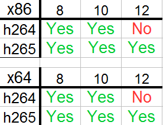

# vEncode

vEncode is a windows batch script to encode video into h264/h265

The development emphasis is on zero-configuration "just works" software.

## Key Features:

- Easy to use
- Scripting friendly
- H264/H265 support
- Supports using the latest versions of key tools (ffmpeg, x264, x265, mkvmerge)
- Supports changing key encode options crf/preset/bit-depth/chroma/resolutions
- Automatically place encoded video into Matroska (mkv) or standard MPEG (mp4) containers
- Easily change the default encode settings

## Basic Usage Guide:

1. copy the folder to somewhere such that vEncode.bat is in your enviornmental path
2. open a command prompt
3. navigate using the CLI to the directory that has the file to encode
4. vEncode myfile.mp4 h265
5. wait a while

## Release Notes:

1. Intended use case is to set lots of videos to encode and come back later to do the audio (gMKVExtractGUI/audacity), subs (Aegisub) and fix the metainfo (mkvmerge-gui).
2. If downloading from github manually (instead of using an offical release.zip) remember to change the line ending format from Unix back to Windows using Notepad++.
3. 8-bit encodes can use either ffmpeg.exe or h264-8.exe/h265-8.exe but 10/12 bit encoding always require x264-10.exe/x264-12.exe and x265-10.exe/x265-12.exe
4. Until I figure out how to pipe stuff in Windows (unlikely), encoding temporarily requires lots of free HD space. If this is an issue, use ffmpeg for the encodes. Note that ffmpeg only supports 8-bit depth for h264/h265.
5. The 10-bit x264 encoder does not appear to honor different chroma values and always uses yuv420p.
6. The 12-bit x265 encoder doesn't seem to like yuv444p.
7. h265 encoding using yuv444p is the same size as yuv420p so wondering if x265 automatically subsamples the chroma to yuv420p if it detects yuv444p. Issue? does not occur when using yuv422p or h264.
7. The following OS architecture chart lists the default compatability of the provided binaries (mid Jan 2016) with various bit depths. If the required binary is not provided (marked as "No" on the chart) and needed, compile/obtain one and place into bin/x86 or bin/x64.



## Example Usage:
```
vEncode myfile.mp4 {h264/h265} {crf} {preset} {bitdepth} {res} {chroma}
Examples:
vEncode myfile.mkv
vEncode "my file.mkv" h264
vEncode "my file.mkv" h265
vEncode file.mkv h264 20
vEncode file.mkv "" 20
vEncode file.mkv "" 20 veryslow
vEncode file.mkv h265 20 slow 8
vEncode file.mkv h265 "" slow 8 720p
vEncode file.mkv h264 "" slow 8 480p yuv420p
vEncode file.mkv h265 20 slow 10 "" yuv422p
vEncode file.mkv h265 18 veryslow 12 1080p yuv444p

Suggested Values and Defaults:
Codec: h264, h265, (h265)
CRF values: usually 16-28, (18)
Presets: ultrafast,fast,medium,slow,veryslow,placebo, (veryslow)
Bit depth: 8, 10 or 12, (10)
Resolution: 480p, 720p, 1080p, (n/a)
PixelFormat: yuv420p, yuv422p, yuv444p, (yuv422p)

To encode all video files in a directory:
vEncode * h265 18 veryslow 10 "" yuv422p
```

## Dependencies: 
```
Basic: ffmpeg.exe, mkvmerge.exe
For 10Bit Support: x264-10.exe, x265-10.exe, ~50GB HD space
For 12Bit Support: x264-12.exe, x265-12.exe, ~50GB HD space
```

## Download:
```
Latest Version: 1.0.0-beta
In Development: 1.0.0-rc1
```
Click [here](//github.com/gdiaz384/vEncode/releases) or on "releases" at the top to download the latest version.

## License:
Pick your License: GPL (any) or BSD (any) or MIT/Apache
